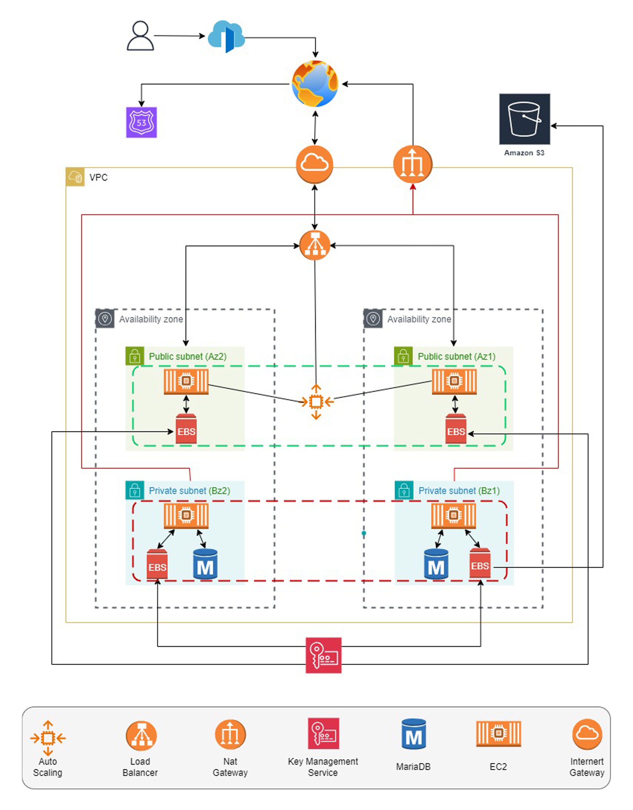
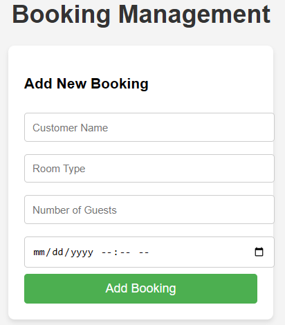
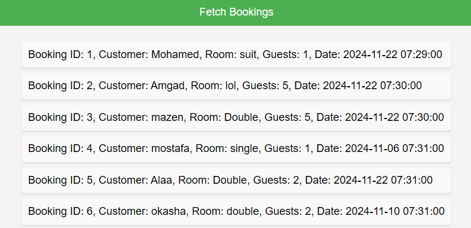
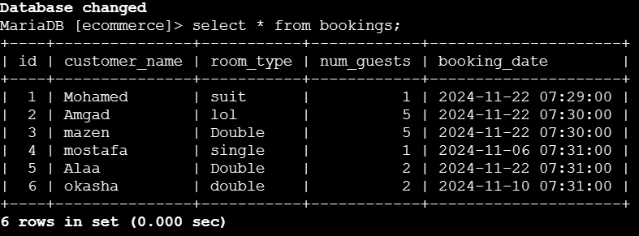

# AWS Booking Management System

### Images









## 1. Launch EC2 Instances

### Public Instances:
- Deploy the **Python Flask** application on EC2 instances in the public subnet.

### Private Instances:
- Deploy **MariaDB (primary and standby)** on EC2 instances in the private subnet.

## 2. Application Setup on EC2 (Public Instances)

### Install Python and Flask:

Run the following commands on your EC2 instance:

```bash
sudo yum update -y
sudo yum install python3 -y
pip3 install flask pymysql
```

## 3. Backend: Python (Flask) Code (`app.py`)

```python
from flask import Flask, request, jsonify, render_template
import pymysql
from datetime import datetime

app = Flask(__name__)

# Database connection settings
db_host = "10.0.132.46"  # Private IP of your MariaDB instance
db_user = "ecommerce_user"
db_password = "securepassword"
db_name = "ecommerce"

# Create connection to MariaDB
def create_connection():
    return pymysql.connect(host=db_host, user=db_user, password=db_password, database=db_name)

@app.route('/')
def home():
    return render_template("booking_application.html")

@app.route('/add_booking', methods=['POST'])
def add_booking():
    # Get data from form submission
    customer_name = request.form['customer_name']
    room_type = request.form['room_type']
    num_guests = request.form['num_guests']
    booking_date = request.form['booking_date']

    # Convert the booking_date to a proper format (from string to datetime)
    booking_date = datetime.strptime(booking_date, '%Y-%m-%dT%H:%M')

    try:
        conn = create_connection()
        cursor = conn.cursor()
        query = "INSERT INTO bookings (customer_name, room_type, num_guests, booking_date) VALUES (%s, %s, %s, %s)"
        cursor.execute(query, (customer_name, room_type, num_guests, booking_date))
        conn.commit()
        conn.close()
        return jsonify({"message": "Booking added successfully!"}), 200
    except Exception as e:
        print(f"Error adding booking: {e}")  # Print error to server log
        return jsonify({"error": str(e)}), 500

@app.route('/get_bookings', methods=['GET'])
def get_bookings():
    try:
        conn = create_connection()
        cursor = conn.cursor()
        cursor.execute("SELECT * FROM bookings")
        result = cursor.fetchall()
        conn.close()
        
        # Convert the result to a list of dictionaries
        bookings = []
        for row in result:
            bookings.append({
                'id': row[0],
                'customer_name': row[1],
                'room_type': row[2],
                'num_guests': row[3],
                'booking_date': row[4].strftime('%Y-%m-%d %H:%M:%S')
            })
        return jsonify(bookings), 200
    except Exception as e:
        return jsonify({"error": str(e)}), 500

if __name__ == '__main__':
    app.run(host='0.0.0.0', port=5000)

```

## 4. Frontend: HTML (`booking_application.html`)

```html
<!DOCTYPE html>
<html lang="en">
<head>
    <meta charset="UTF-8">
    <meta name="viewport" content="width=device-width, initial-scale=1.0">
    <title>Booking System</title>
    <style>
        body {
            font-family: Arial, sans-serif;
            background-color: #f4f4f4;
            margin: 0;
            padding: 0;
            display: flex;
            justify-content: center;
            align-items: center;
            height: 100vh;
            flex-direction: column;
        }
        h1 {
            text-align: center;
            color: #333;
        }
        .form-container {
            background-color: #fff;
            padding: 20px;
            border-radius: 8px;
            box-shadow: 0 4px 6px rgba(0, 0, 0, 0.1);
            width: 300px;
            margin-bottom: 20px;
        }
        input[type="text"], input[type="number"], input[type="datetime-local"] {
            width: 100%;
            padding: 10px;
            margin: 8px 0;
            border-radius: 4px;
            border: 1px solid #ccc;
        }
        button {
            background-color: #4CAF50;
            color: white;
            padding: 10px 20px;
            border: none;
            border-radius: 4px;
            cursor: pointer;
            width: 100%;
            font-size: 16px;
        }
        button:hover {
            background-color: #45a049;
        }
        #bookings-list {
            list-style-type: none;
            padding: 0;
        }
        #bookings-list li {
            background-color: #f9f9f9;
            margin: 8px 0;
            padding: 10px;
            border-radius: 4px;
            box-shadow: 0 2px 3px rgba(0, 0, 0, 0.1);
        }
    </style>
</head>
<body>
    <h1>Booking Management</h1>
    
    <!-- Form for adding a new booking -->
    <div class="form-container">
        <h3>Add New Booking</h3>
        <form id="bookingForm">
            <input type="text" id="customer_name" placeholder="Customer Name" required>
            <input type="text" id="room_type" placeholder="Room Type" required>
            <input type="number" id="num_guests" placeholder="Number of Guests" required>
            <input type="datetime-local" id="booking_date" required>
            <button type="submit">Add Booking</button>
        </form>
    </div>

    <!-- Button to fetch and display bookings -->
    <button onclick="fetchBookings()">Fetch Bookings</button>
    
    <!-- List of bookings -->
    <ul id="bookings-list"></ul>

    <script>
        // Function to fetch bookings from the server and display them
        function fetchBookings() {
            fetch('http://16.16.56.112:5000/get_bookings')  // Make sure to replace with your actual IP if needed
                .then(response => response.json())
                .then(data => {
                    let bookingsList = document.getElementById("bookings-list");
                    bookingsList.innerHTML = "";  // Clear previous list
                    data.forEach(booking => {
                        let li = document.createElement("li");
                        li.textContent = `Booking ID: ${booking.id}, Customer: ${booking.customer_name}, Room: ${booking.room_type}, Guests: ${booking.num_guests}, Date: ${booking.booking_date}`;
                        bookingsList.appendChild(li);
                    });
                })
                .catch(error => console.log('Error fetching bookings:', error));
        }

        // Function to handle the form submission and add a new booking
        document.getElementById("bookingForm").addEventListener("submit", function(event) {
            event.preventDefault();

            const customerName = document.getElementById("customer_name").value;
            const roomType = document.getElementById("room_type").value;
            const numGuests = document.getElementById("num_guests").value;
            const bookingDate = document.getElementById("booking_date").value;

            // Create the booking object
            const bookingData = {
                customer_name: customerName,
                room_type: roomType,
                num_guests: numGuests,
                booking_date: bookingDate
            };

            // Send POST request to the server to add the booking
            fetch('http://16.16.56.112:5000/add_booking', {
                method: 'POST',
                body: new URLSearchParams(bookingData)  // Using URLSearchParams for form-data format
            })
            .then(response => response.json())
            .then(data => {
                console.log('Booking added successfully:', data);
                alert('Booking added successfully!');
                document.getElementById("bookingForm").reset(); // Reset the form
            })
            .catch(error => {
                console.log('Error adding booking:', error);
                alert('Error adding booking.');
            });
        });
    </script>
</body>
</html>

```

## 5. Database Schema

#### Table: `bookings`

```sql
CREATE TABLE bookings (
    id INT AUTO_INCREMENT PRIMARY KEY,
    customer_name VARCHAR(255) NOT NULL,
    room_type VARCHAR(255) NOT NULL,
    num_guests INT NOT NULL,
    booking_date DATETIME NOT NULL
);
```

## 6. Backing Up MariaDB Database to S3

To backup the MariaDB database to S3, use the following commands:

### Step 1: Install AWS CLI

```bash
sudo yum install aws-cli -y
```

### Step 2: Configure AWS CLI with your credentials

```bash
aws configure
```

### Step 3: Create a database backup

Create a backup of your MariaDB database:

```bash
mysqldump -u root -p ecommerce > /home/ec2-user/ecommerce_backup.sql
```

### Step 4: Upload the backup to S3

```bash
aws s3 cp /home/ec2-user/ecommerce_backup.sql s3://your-bucket-name/ecommerce_backup.sql
```

## 7. Testing and Validation

1. **Access the Flask app** via the public EC2 instance IP.
2. **Add and view bookings** through the frontend interface.
3. **Complete the remaining steps** to integrate Auto Scaling, S3 backups, and QuickSight visualization!

---
